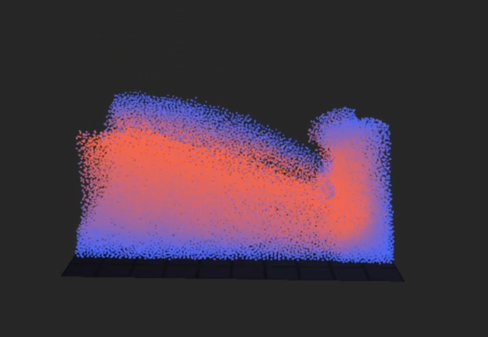
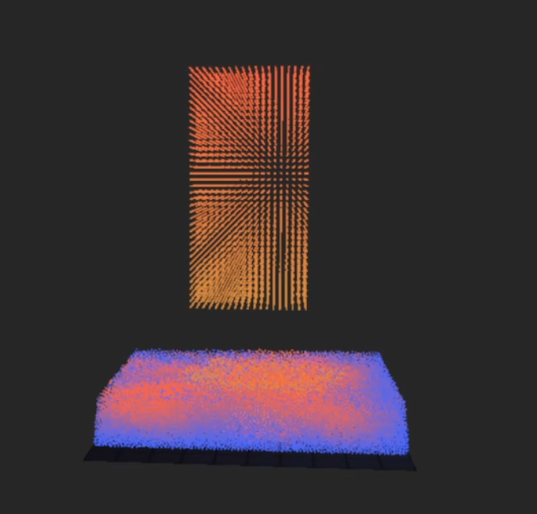
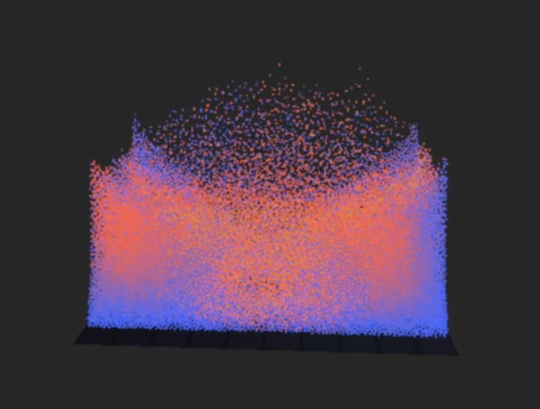
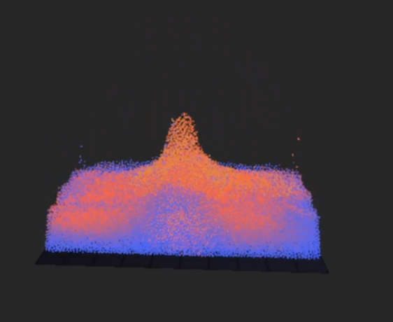

# Position Based Fluids (PBF) Simulation Using OpenGL

## Overview

This project implements a **real-time Position-Based Fluids (PBF)** simulation using OpenGL and GPU compute shaders. Our approach enforces incompressibility via density constraints and augments simulation fidelity with vorticity confinement and XSPH viscosity.

PBF provides the benefits of stability and efficiency by solving position-level constraints rather than force-based equations, making real-time fluid simulation feasible.

---

## Features

- GPU-accelerated PBF solver using OpenGL compute shaders  
- SPH kernel-based density and pressure estimation  
- Vorticity confinement and XSPH viscosity  
- Uniform grid for neighbor search  
- Real-time rendering of fluid particles with lighting  
- Free-fly camera for user navigation

---

## Simulation Scenarios

### 1. Dam Break

A block of fluid particles is released under gravity into an empty container to simulate splash and wave behavior.

### 2. Water Drop 1

A vertical column of fluid particles collides with a surface to observe bounce and energy transfer.

### 3. Water Drop 2

This scenario examines inter-particle interaction and surface cohesion during a splash event.

### 4. Water Drop 3

Evaluates symmetrical wave propagation and vertical force response in a stable basin.

---

## Core Algorithm

Our implementation closely follows Macklin & Müller's 2013 PBF paper:

1. **External Forces & Prediction**  
   Explicit Euler integration on the GPU (gravity, motion)

2. **Neighbor Search**  
   Spatial hashing with a uniform 3D grid

3. **Density Constraint Solving**  
   Jacobi-style iteration to enforce incompressibility

4. **Velocity Update**  
   Derived from corrected positions

5. **Vorticity & Viscosity**  
   Enhances rotational effects and smoothness

---

## Rendering Pipeline

Particles are rendered as spheres using `GL_POINTS` and custom shaders. A separate ground plane is used for reference. The rendering loop is decoupled from the simulation to maintain responsiveness.

---

## Performance

- Runs efficiently with ~100K particles  
- Density and neighbor search are bottlenecks (~0.02ms each per frame)  
- GPU-only compute shader architecture minimizes CPU overhead

---

## Limitations

- Boundary artifacts and particle stacking  
- Constraint solver convergence is local and slow at scale  
- Artificial pressure term entangles clustering and surface tension  
- No GPU-to-GPU rendering pipeline — data transfer overhead

---

## Future Work

- GPU-only rendering pipeline  
- Red-black or multigrid solver integration  
- Multiphase fluid interactions  
- Improved boundary conditions with signed distance fields

---

## References

1. Macklin, M., Müller, M. *Position Based Fluids*, ACM Transactions on Graphics, 2013  
2. Müller, M. et al. *Position Based Dynamics*, Journal of Visual Communication, 2007  
3. Solenthaler, B., Pajarola, R. *Predictive-Corrective Incompressible SPH*, SIGGRAPH 2009  
4. Zhu, Y., Bridson, R. *Animating Sand as a Fluid*, ACM TOG, 2005  
